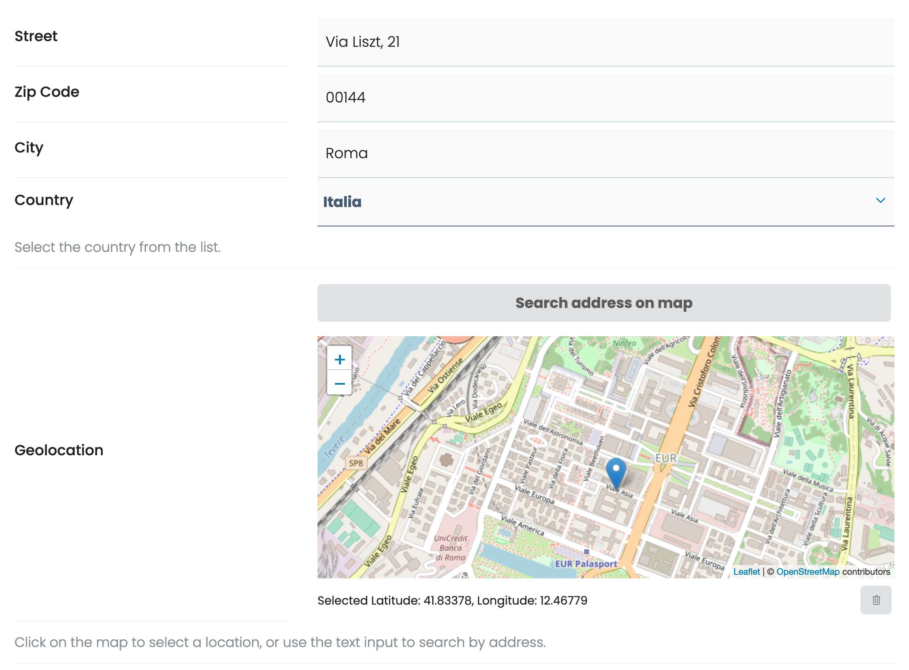

# volto-venue

An addon for [Volto](https://github.com/plone/volto) as a frontend for collective.venue

To be used with mrs-developer, see [Volto docs](https://docs.voltocms.com/customizing/add-ons/) for further usage informations.


## Usage

You can use this in combination with `collective.venue` and it will work out of the box, otherwise you can define a field called `geolocation` or add the geolocation widget on a custom field.

```js
import { GeoLocationWidget } from 'volto-venue';

config.widgets.id = {
  ...config.widgets.id,
  geolocation: GeoLocationWidget,
};
```

### Screenshot




### GeolocationWidget

This widget allows to compile a form with an address data, or use the map to select a point using coordinates.


### OSMMap

This component shows a map from OpenStreetMap.
Accepts these props:

| Prop | Type | Default | Description |
| --- | --- | --- | --- |
| position | Array<number> | | Coordinates: [lat, lng] | 
| zoom | number | `15` | Map zoom | 
| onMarkerDragEnd | func | `() => {}`Callback to handle marker position change on the map | 
| draggable | boolean | false | Enables dragging the marker on the map | 
